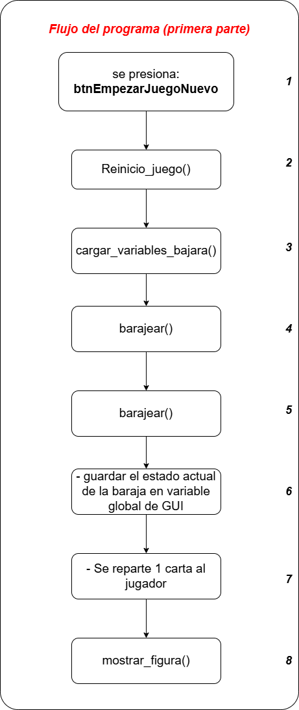

# JUEGO DEL SIENTE Y MEDIO IMPLEMENTADO EN MATLAB

# Notas generales
* Debido a que GUIDE fue elimiado en las versiones recientes, este proyecto corre en la versión R2024a.

* Para ejecutar la interfaz grafica de edición de GUIDE, ejecuta la siguiente instrucción en la terminal de matlab:

    guide nombre_archivo.fig

* Se han colocado nombres a los identificadores de los componentes (TAGS), se puede visualizar en la siguiente imagen:

## Diagrama de flujos

Para el commit del 21 de febrero 12:20, se ha implementado hasta la parte 3 del diagrama de flujos para la primera parte del programa (correspondiente al jugador)
